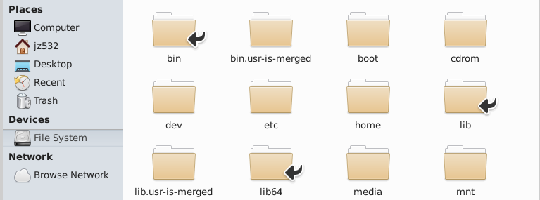

#### This branch is optimized by *Junyan Zhou* to facilitate easy reproduction of our group's codes. Note that *Shucheng Jia* made great contributions to the original codes.

### First, in 'filemanager' click File System - /home . Under this path, run:
```git clone -b Ryan https://gitlab.oit.duke.edu/jz532/roboticsfinalproject.git```



```xhost +local:docker```

```
docker run --rm -it \
  --net=host \
  -e DISPLAY=$DISPLAY \
  -v /tmp/.X11-unix:/tmp/.X11-unix \
  -v /home/roboticsfinalproject:/root/roboticsfinalproject \
  --gpus all \
  --name ros2_final \
  gitlab-registry.oit.duke.edu/introtorobotics/mems-robotics-toolkit:kinova-jazzy-latest bash
```

### In VM
```
sudo chown -R $USER:$USER /home/roboticsfinalproject/
```

In docker container: (when you first get into the container PATH could be /workspaces or something like this)
```cd ../roboticsfinalproject/ros2_ws```

or try:

```cd /root/roboticsfinalproject/ros2_ws``` instead

```
colcon build --symlink-install
source install/setup.bash
```

1 gazebo
```
ros2 launch final_moveit dual_gen3_lite.launch.py
```

2 new terminal controller and table
```
./start_lab.sh
./spawn.sh 
```

### After step2, you may wait a while for Gazebo setup

3rviz
```
source install/setup.bash
ros2 launch final_moveit dual_moveit.launch.py
```

4.1 add camera to gazebo
```
ros2 run ros_gz_sim create \
  -file /root/roboticsfinalproject/ros2_ws/src/final_moveit/sdf/depth_cam.sdf \
  -name sim_depth_camera \
  -x 0.42 -y 0 -z 1.0 \
  -R 0 -P 1.5708 -Y 0
```


4.2 bridge
```
ros2 run ros_gz_bridge parameter_bridge \
/sim/camera/image@sensor_msgs/msg/Image@gz.msgs.Image \
/sim/camera/depth_image@sensor_msgs/msg/Image@gz.msgs.Image \
/sim/camera/camera_info@sensor_msgs/msg/CameraInfo@gz.msgs.CameraInfo
```

4.3 point cloud
```
ros2 run depth_image_proc point_cloud_xyz_node \
  --ros-args \
  -p use_sim_time:=true \
  -p reliability_policy:=best_effort \
  -r image_rect:=/sim/camera/depth_image \
  -r camera_info:=/sim/camera/camera_info \
  -r points:=/points
```

4.4 transform 
```
ros2 run tf2_ros static_transform_publisher \
  --x 0.42 --y 0 --z 1.0 \
  --yaw -1.5708 --pitch 0 --roll -3.14159 \
  --frame-id world \
  --child-frame-id sim_depth_camera/camera_link/rgbd
```

5.
```
cd ~/roboticsfinalproject/ros2_ws/src/final_moveit/final_moveit/scripts/

sudo apt update
sudo apt install python3-sklearn

python3 perception_data.py
```

```
colcon build --packages-select final_moveit && source install/setup.bash

python3 src/final_moveit/final_moveit/scripts/generate_game_script.py

colcon build --packages-select final_moveit && source install/setup.bash

ros2 run final_moveit dual_arm_replay --ros-args -p task:=replay_full
```